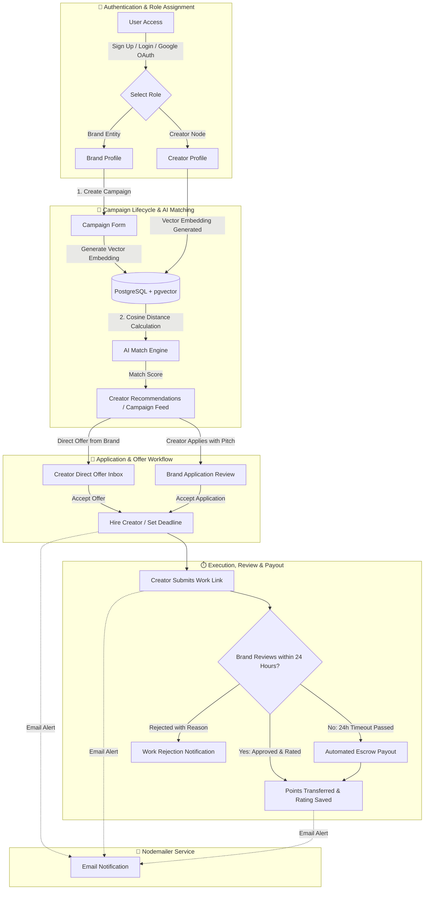

# SponsorForge 🚀
> **AI-Powered Creator & Brand Sponsorship Marketplace Platform**

SponsorForge is an end-to-end marketplace connecting **Brands** and **Content Creators**. Powered by **AI Vector Embeddings (pgvector + SentenceTransformers)**, SponsorForge delivers semantic matching between campaign requirements and creator profiles. It streamlines sponsorship workflows through an escrow points system, live deadline timers, automated 24-hour payout guarantees, and real-time email notifications.

---

## 📋 Table of Contents
- [✨ Key Features](#-key-features)
- [🔄 Platform Workflow Diagram](#-platform-workflow-diagram)
- [🛠️ Tech Stack](#️-tech-stack)
- [🚀 Getting Started](#-getting-started)
  - [Prerequisites](#prerequisites)
  - [1. Database Setup (PostgreSQL + pgvector)](#1-database-setup-postgresql--pgvector)
  - [2. Backend Setup](#2-backend-setup)
  - [3. Frontend Setup](#3-frontend-setup)
- [📊 Seeding Sample Data](#-seeding-sample-data)
- [🔑 API Endpoints Overview](#-api-endpoints-overview)
- [🤝 Contributing](#-contributing)

---

## ✨ Key Features

### 🧠 1. AI-Powered Vector Similarity Match Engine
- **384-Dimensional Embeddings**: Powered by `SentenceTransformer('sentence-transformers/all-MiniLM-L6-v2')`.
- **High-Performance Cosine Search**: Uses `pgvector` HNSW index in PostgreSQL to calculate cosine distance between campaign goals and creator bios/niches.
- **Smart Recommendations**: Recommends top matching creators for brand campaigns and top relevant campaigns for creators.

### 🏢 2. Brand Hub & Campaign Management
- **Campaign Creation Wizard**: Specify target platform (YouTube, Instagram, TikTok, Twitch), niche, required subscriber count, duration, points reward, and deliverable instructions.
- **Direct Creator Offers**: Send targeted campaign offers directly to specific creators or publish publicly.
- **Application Portal**: Review applicant pitches, channel analytics, engagement rates, and previous work portfolios.
- **Work Review & Approval**: Inspect submitted deliverable links, rate creators (1-5 stars), leave feedback, or reject with clear context.

### 🎥 3. Creator Workspace & Opportunities
- **AI Match Feed**: See instant compatibility scores for active brand campaigns.
- **Direct Offer Inbox**: Receive and accept/reject direct sponsorship offers from brands.
- **Deliverable Submission Portal**: Submit work proof URL before the submission deadline with live countdown timers.
- **Points & Ratings Portfolio**: Earn platform reward points and build verified rating history from completed campaigns.

### ⏱️ 4. Automated Campaign & Application Lifecycle
- **Scheduled & Active States**: Auto-transitions scheduled campaigns to `active` when start time arrives.
- **Live Deadline Timers**: Displays precise countdowns for submission deadlines.
- **Auto-Expiration**: Applications with missed deadlines automatically transition to `expired` status.
- **24-Hour Auto-Payout Guarantee**: If a brand does not review submitted work within 24 hours, the backend automatically transfers reward points to the creator and marks the work completed.

### 📧 5. Real-Time Email Notifications
- Integration with **Node.js Nodemailer** to deliver HTML notifications for account registration, campaign creation, direct offers, submissions, approvals, ratings, payouts, and deadline expirations.

### 🔐 6. Secure Authentication & Role Management
- **JWT Authentication**: Secure Access & Refresh tokens handled via Django REST Framework SimpleJWT.
- **Google OAuth 2.0**: One-click social authentication for both Brand and Creator profiles.

---

## 🔄 Platform Workflow Diagram



---

## 🛠️ Tech Stack

### Frontend
- **Framework**: [React 19](https://react.dev/) + [Vite](https://vitejs.dev/)
- **Routing**: [React Router DOM v7](https://reactrouter.com/)
- **Styling**: [Tailwind CSS v4](https://tailwindcss.com/)
- **Icons**: [Lucide React](https://lucide.dev/)
- **HTTP Client**: [Axios](https://axios-http.com/)
- **Authentication**: `@react-oauth/google`

### Backend
- **Framework**: [Django 6.0](https://www.djangoproject.com/) + [Django REST Framework](https://www.django-rest-framework.org/)
- **AI / Embeddings**: `sentence-transformers` (`all-MiniLM-L6-v2`)
- **Vector Search**: `pgvector-python`
- **Authentication**: `djangorestframework-simplejwt`
- **CORS**: `django-cors-headers`

### Database & Email
- **Database**: PostgreSQL 15+ with `pgvector` extension
- **Email Dispatch**: Node.js with `nodemailer` (invoked securely via Python subprocess)

---

## 🚀 Getting Started

Follow these instructions to set up and run SponsorForge locally.

### Prerequisites
Make sure you have the following installed on your system:
- **Node.js** (v18.0.0 or higher)
- **Python** (v3.10 or higher)
- **PostgreSQL** (v15+ recommended) with `pgvector` extension installed.

---

### 1. Database Setup (PostgreSQL + pgvector)

1. Open your PostgreSQL console (`psql` or pgAdmin) and create a new database:
   ```sql
   CREATE DATABASE sponserforge_db;
   ```
2. Connect to `sponserforge_db` and enable the vector extension:
   ```sql
   \c sponserforge_db;
   CREATE EXTENSION IF NOT EXISTS vector;
   ```
3. **Restore Included Project Database**:
   You can populate the database using either the included SQL dump or Django fixture:
   - **Option A (Native PostgreSQL Restore)**:
     ```bash
     psql -U postgres -d sponserforge_db -f backend/sponserforge_db_backup.sql
     ```
   - **Option B (Django Loaddata)**:
     ```bash
     cd backend
     python manage.py loaddata database_data.json
     ```

4. Update database credentials in `backend/core/settings.py` if necessary:
   ```python
   DATABASES = {
       'default': {
           'ENGINE': 'django.db.backends.postgresql',
           'NAME': 'sponserforge_db',
           'USER': 'postgres',
           'PASSWORD': 'YOUR_POSTGRES_PASSWORD',
           'HOST': 'localhost',
           'PORT': '5432',
       }
   }
   ```

---

### 2. Backend Setup

1. **Navigate to the backend directory**:
   ```bash
   cd backend
   ```

2. **Create and activate a virtual environment**:
   - **Windows**:
     ```powershell
     python -m venv env
     .\env\Scripts\activate
     ```
   - **Linux/macOS**:
     ```bash
     python3 -m venv env
     source env/bin/activate
     ```

3. **Install Python Dependencies**:
   ```bash
   pip install -r requirements.txt
   ```

4. **Install Node Dependencies** *(Required for Nodemailer service)*:
   ```bash
   npm install
   ```

5. **Run Database Migrations**:
   ```bash
   python manage.py makemigrations
   python manage.py migrate
   ```

6. **Start the Django Development Server**:
   ```bash
   python manage.py runserver
   ```
   The backend API will run on `http://127.0.0.1:8000/`.

---

### 3. Frontend Setup

1. **Open a new terminal and navigate to the frontend directory**:
   ```bash
   cd frontend
   ```

2. **Install Frontend Dependencies**:
   ```bash
   npm install
   ```

3. **Start the Vite Development Server**:
   ```bash
   npm run dev
   ```

4. **Access the Application**:
   Open your browser and navigate to:
   ```
   http://localhost:5173
   ```

---

## 📊 Seeding Sample Data

To quickly populate the database with realistic sample brands, creator profiles, active campaigns, vector embeddings, and history, run the seed script from the `backend` folder:

```bash
python seed_rich_data.py
```

This populates demo accounts for instant testing:
- **Brand Accounts**: `techcorp`, `gameverse`, `fitlife`
- **Creator Accounts**: `alextech`, `gamer_girl`, `fit_sarah`
- Default password for test accounts: `password123`

---

## 🔑 API Endpoints Overview

| Method | Endpoint | Description | Access |
| :--- | :--- | :--- | :--- |
| `POST` | `/api/auth/signup/` | Register Brand or Creator user | Public |
| `POST` | `/api/auth/login/` | Obtain JWT tokens & user profile | Public |
| `POST` | `/api/auth/google/` | Authenticate via Google OAuth | Public |
| `GET/PUT`| `/api/auth/profile/` | View or update active profile | Authenticated |
| `GET` | `/api/campaigns/` | List all active/scheduled campaigns | Authenticated |
| `POST` | `/api/campaigns/` | Create a new campaign (Brand only) | Authenticated |
| `GET` | `/api/campaigns/<id>/match/` | AI matching creators for campaign | Authenticated |
| `GET` | `/api/creator/match-campaigns/<id>/` | AI matching campaigns for creator | Authenticated |
| `GET/POST`| `/api/applications/` | List or submit campaign applications | Authenticated |
| `POST` | `/api/applications/<id>/submit_work/` | Creator submits deliverable link | Authenticated |
| `POST` | `/api/applications/<id>/complete_payout/` | Brand approves work & pays points | Authenticated |
| `GET` | `/api/users/search/` | Search & filter profiles by niche/platform | Authenticated |

---

## 🤝 Contributing

1. Fork the repository
2. Create your feature branch (`git checkout -b feature/AmazingFeature`)
3. Commit your changes (`git commit -m 'Add some AmazingFeature'`)
4. Push to the branch (`git push origin feature/AmazingFeature`)
5. Open a Pull Request

---
Made with ❤️ by the SponsorForge Team.
